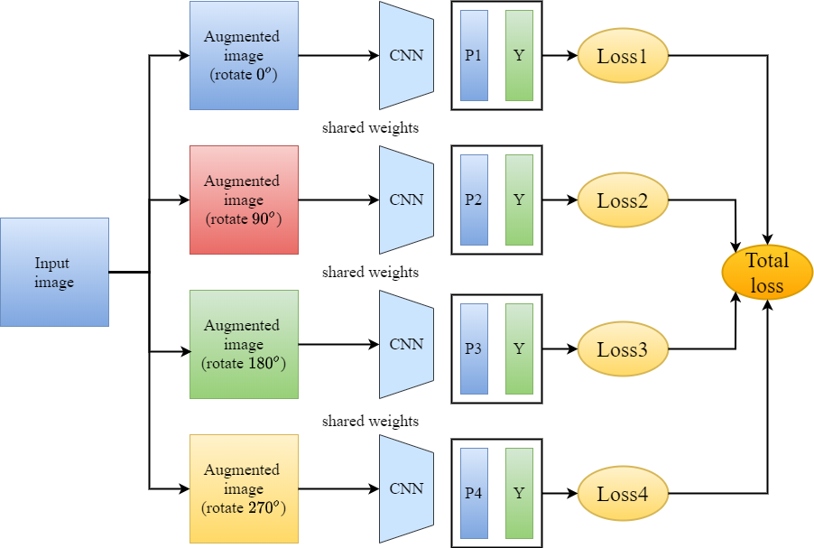
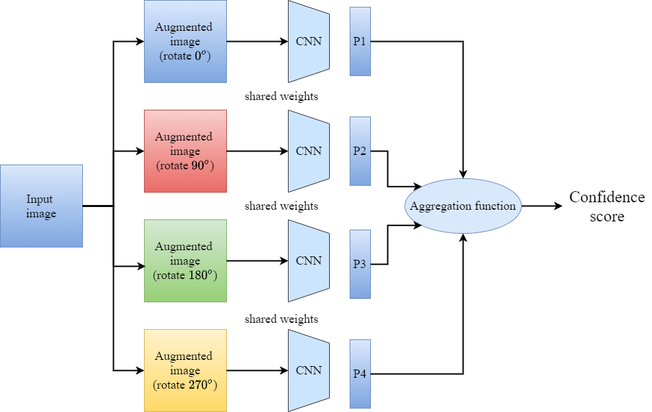

# Data-Augmentation-Network (DAN)
DAN is an efficient data augmentation network to detect out-of-distribution image data by introducing a set of common geometric operations into training and testing images. The output predicted probabilities of the augmented data are combined by an aggregation function to provide a confidence score to distinguish between in-distribution and out-of-distribution image data. Different from other approaches that use out-of-distribution image data for training networks, we only use in-distribution image data in the proposed data augmentation network. This advantage makes our approach more practical than other approaches, and can be easily applied to various neural networks to improve security in practical applications.

---
# How it works
## Training
When training a neural network, N (e.g. 4) rotated images are generated and sequentially send into the model. The model learns to classify them into the same class, as shown in the following.




## Testing
In the testing phase, the input image will also be rotated into N images and sent into the trained CNN model, and then the total N predicted probabilities are aggregated to obtain the final confidence score.
images and sent into the trained CNN model, and then the
total N predicted probabilities are aggregated to obtain the
final confidence score.



## Hypothesis
DAN is based on the assumption that when an input image comes from out-of-distribution, the confidence score should be lower. Because N predicted probabilities from rotated images may be inconsistent, the followed aggregation funcution can detect it.

---
# Code Example
## Example1: Training the model 
Please change the setting in configs/train_config.py and run "python main.py"
```
# configuration for training
parser = argparse.ArgumentParser()
parser.add_argument("--lr", type=float, default=0.1, help="learning rate for CNN model")
parser.add_argument("--batch", type=int, default=32, help="batch size")
parser.add_argument("--epoch", type=int, default=100, help="epoch")
parser.add_argument("--classNum", type=int, default=10, help="class number")
parser.add_argument("--imgSize", type=int, default=32, help="size of input image")
parser.add_argument("--data_root", type=str, default="/usr/share/dataset/cifar10", help="root dir of dataset")
parser.add_argument("--dir_save_ckpt", type=str, default="ckpts/cifar10", help="dir for saving checkpoints")
parser.add_argument("--dir_save_log", type=str, default="logs/cifar10", help="dir for saving log file")
parser.add_argument("--worker", type=int, default=4, help="number of subprocess for loading data")
parser.add_argument("--decay", type=float, default=5e-4, help="weight decay for optimizer")
parser.add_argument("--momentnum", type=float, default=0.9, help="momentnum for optimizer")
parser.add_argument("--rot", type=int, default=4, help="how many different angles for rotation.")
parser.add_argument("--pretrain", type=str, default="x", help="path to pretrained model (default = No)")
args = parser.parse_args()

```

## Example2: Validate the performance 
Please change the setting in configs/train_config.py and run "python detect.py". This module collects confidence scores from in-distribution (e.g. CIFAR-10) and out-of-distribution data (e.g. svhn, texture, lsun,...). Next, introduce metrics such as AUROC, AUPR to validate the performance.
```
# params for detection
parser = argparse.ArgumentParser()
parser.add_argument("--batch", type=int, default=200, help="batch size")
parser.add_argument("--classNum", type=int, default=10, help="class number")
parser.add_argument("--imgSize", type=int, default=32, help="size of input image")
parser.add_argument("--InData", type=str, default="/usr/share/dataset/cifar10", help="root dir of dataset")
parser.add_argument("--ckpt", type=str, default="ckpts/cifar10/last.pt")
parser.add_argument("--worker", type=int, default=4, help="number of subprocess for loading data")
parser.add_argument("--store_dir", type=str, default='logs/cifar10')
parser.add_argument("--model", type=str, default="w402", help="model used for training")
parser.add_argument("--num_eval", type=int, default=1, help="number of testing")
parser.add_argument("--vis", type=int, default=0, help="visualize loader")
parser.add_argument("--method", type=str, default='MSP', help="method for eval")
parser.add_argument("--rot", type=int, default=4, help="how many different angles for rotations")
parser.add_argument("--pretrain", type=str, default="x", help="path to pretrained model (default = No)")
parser.add_argument("--assume", type=int, default=0)
det_cfg = parser.parse_args()
```
---
# NOTE
* We have provided a weight file (ckpts/cifar10/last.pt) which assits validate the program.
* Please check the structure of your dataset (expect fot synthetic dataset) as the same as the following.
```
cifar10
│    class.txt  
│
|    train
│    │
│    └───cat
│       │   cat1.jpg
│       │   cat2.jpg
│       │   ...
|    test
│    │
│    └───cat
│       │   cat1.jpg
│       │   cat2.jpg
│       │   ...
```
---
# Environment
* Linux 18.04
* PyTorch 1.2.0
* Python 3.5.2
* One 2080-Ti 11G

---
# Cite
This is the code for our paper titled "An efficient data augmentation network for out-of-distriubution image detection" If you find this work useful in your research, please cite:
```
@ARTICLE{9363111,
  author={C. -H. {Lin} and C. -S. {Lin} and P. -Y. {Chou} and C. -C. {Hsu}},
  journal={IEEE Access}, 
  title={An Efficient Data Augmentation Network for Out-of-Distribution Image Detection}, 
  year={2021},
  volume={},
  number={},
  pages={1-1},
  doi={10.1109/ACCESS.2021.3062187}}

```

---
# Contributor
The primary developers of DAN are Cheng-Hung Lin, Cheng-Shian Lin, Po-Yung Chou, and Chen-Chien Hsu. Website maintainer Cheng-Shian Lin.


